# 🚑 Operation Theater Management System  

An all-in-one platform that solves the age-old hospital chaos of **multiple doctors fighting for the same OT slot** 🏥. With our system, **double-bookings vanish, schedules become crystal clear, and operations run smoothly**.  

## 🎥 **Demo Videos**  

### 👉 **[Watch Demo Video](https://www.loom.com/share/e4a6c90c1dbe478697bcd03533f7fc73?sid=7b5cd5a5-2a59-4d11-ae7a-f38fead9b341)**  
### [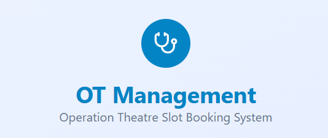](https://github.com/your-repo-link/demo.mp4)  
*(Click the image to watch the demo)*  

---

## 📸 Screens & Features  

### 🔑 Sign In / Sign Up & Authentication  
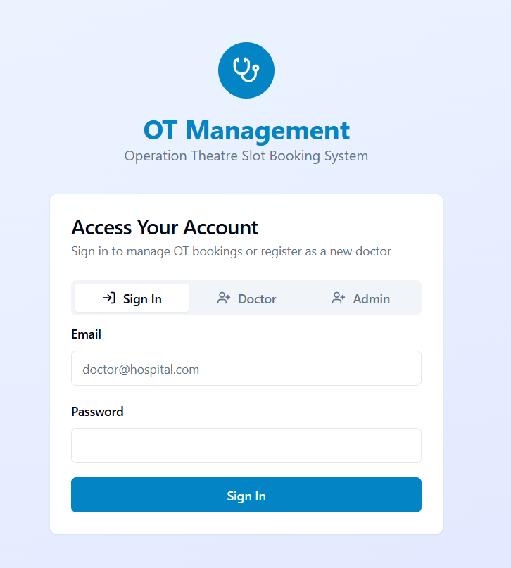  
Secure login and signup system for doctors and admins. Only authenticated users can access the booking system, ensuring data privacy and safe access.  

---

### 👨‍⚕️ Doctor Dashboard Preview  
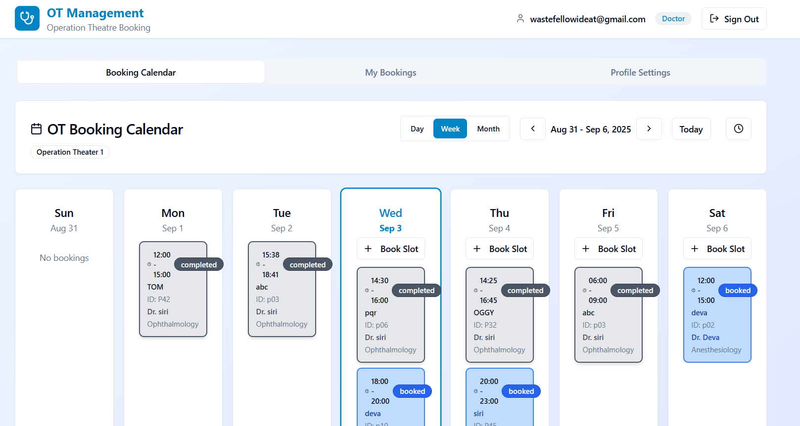  
Doctors get a **clear overview** of all available slots, their bookings, and overall OT usage. The dashboard shows quick stats like total bookings, completed, cancelled, and available slots.  

---

### 📅 Day View – OT Calendar  
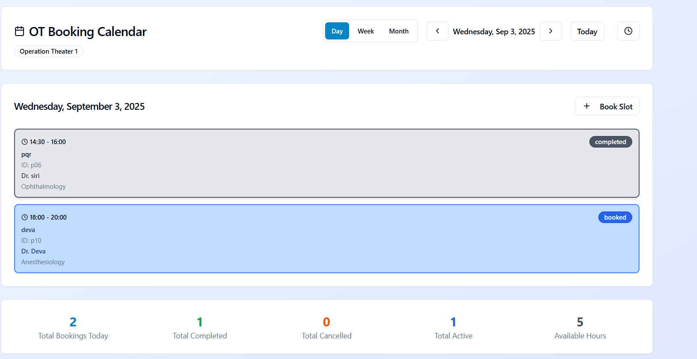  
Quickly view and manage **daily OT schedules** with clarity on available slots and occupied timings.  

---

### 🧑 Select Patient  
  
Search and select patients quickly for scheduling or reviewing their records.  

---
### ➕ Add Patient  
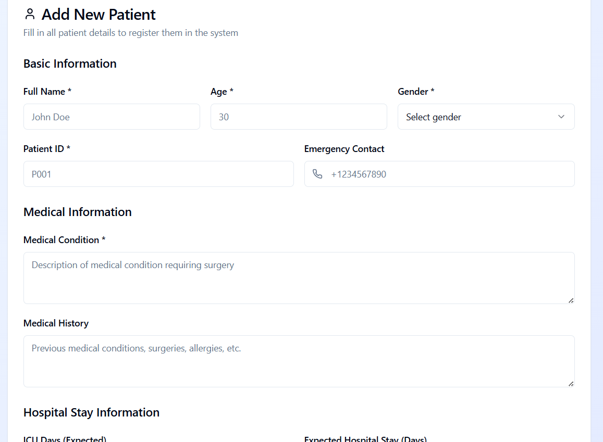  
Doctors can add new patients with detailed information including medical history, emergency contacts, and hospital stay details.  

---


### ✅ Patient Confirmation  
  
Before finalizing surgery slots, doctors/admins can **review patient details** including medical history, allergies, and emergency contacts.  

---
### 📅 Slot Booking Calendar  
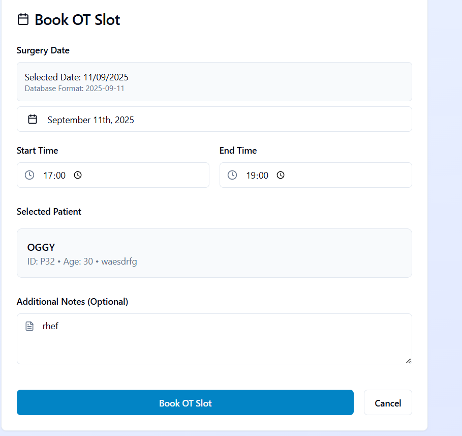  
A dynamic calendar where doctors can:  
- View slots in **day, week, or month mode**  
- Instantly book an available slot with one click  
- See other doctors’ bookings clearly to avoid clashes  

---

### 🧑‍🤝‍🧑 Doctors – My Bookings  
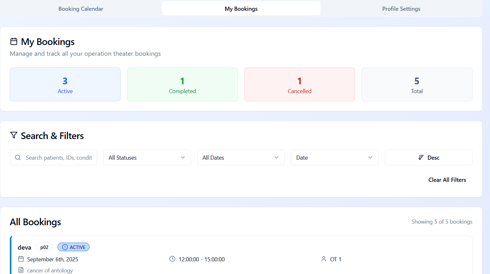  
Doctor's booking history is maintained, showing upcoming surgeries, completed ones, and any cancellations. This ensures transparency and better hospital-doctor communication.  

---

### ⚙️ Profile Settings  
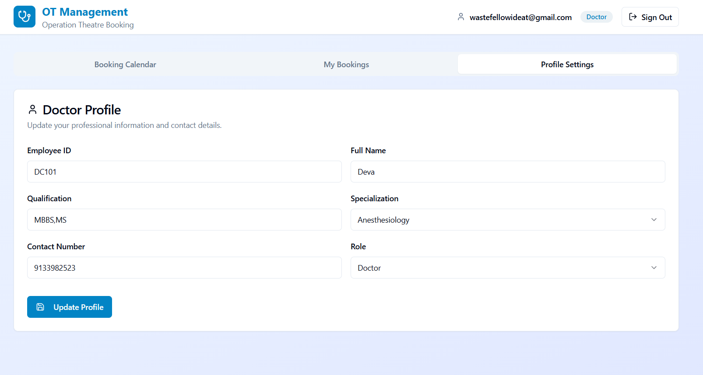  
Doctors and admins can manage their profiles — update personal details, change password, and configure preferences easily.  

---

### 🛠️ Admin Dashboard  
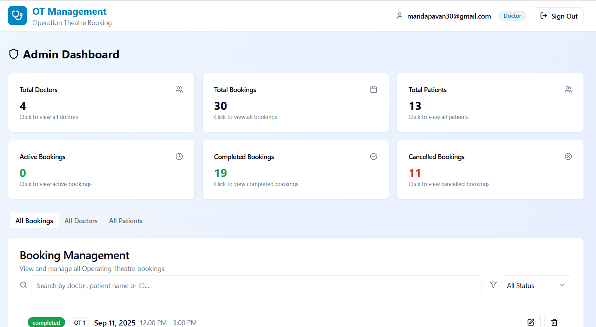  
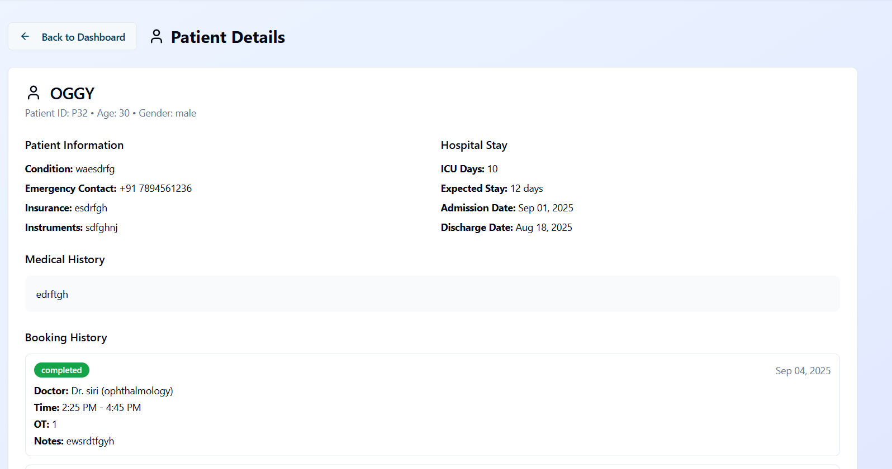  
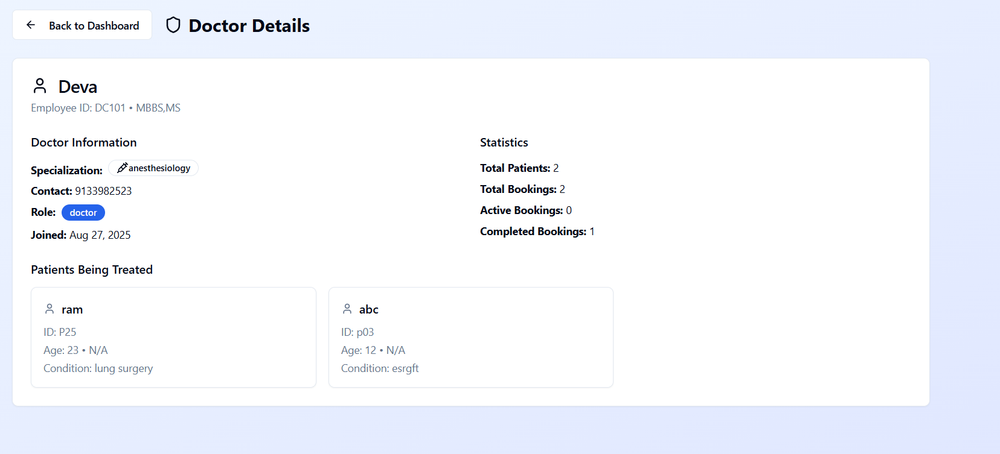  
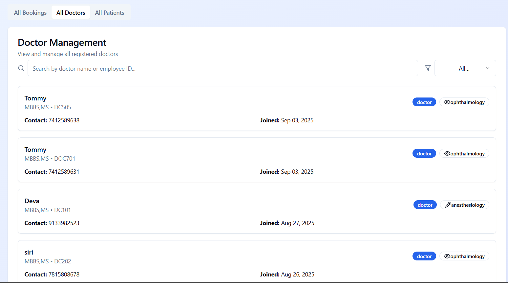  

Admins have complete control:  
- See all doctor bookings in real time  
- Track slot utilization (active, cancelled, completed surgeries)  
- Manage doctors and patient data  
- Keep the OT scheduling **organized and conflict-free**  
---


## ✨ Features That Make It Stand Out  

✅ **Real-time OT Slot Booking** – Doctors can book slots instantly without clashes.  
✅ **Conflict-Free Scheduling** – Prevents double-bookings automatically 🚫.  
✅ **Daily / Weekly / Monthly Calendar Views** – See the bigger picture at a glance 📅.  
✅ **Live Availability Tracker** – Shows booked, available, active, cancelled, and completed surgeries in real time.  
✅ **One-Click Booking** – A clean “Book Slot” button makes reservations effortless ⚡.  
✅ **Doctor Details with Departments** – Every booking clearly shows doctor name & department 👨‍⚕️👩‍⚕️.  
✅ **Responsive UI** – Works smoothly on desktops, tablets, and mobiles 📱💻.  
✅ **Authentication Ready (Future Scope)** – Role-based logins for doctors, admins, and staff.  
✅ **Scalable Database** – Built on PostgreSQL via Supabase for reliable performance.  

---
## 🛠️ Tech Stack  
  
  
  
  
  
  
  
- **Frontend:** TypeScript + JSX + React (powered by Vite) ⚡  
- **Backend:** Node.js + Express (auto-managed APIs) 🌐  
- **Database:** PostgreSQL (Supabase) 🗄️  
- **Hosting & Deployment:** Supabase + Vercel/Netlify 🚀  
- **Version Control:** Git + GitHub 🔗  

---

## 🚀 Getting Started  

Want to run it on your machine? It’s CRAZY SIMPLE. Just follow these steps:  

```bash
# 1️⃣ Clone the repository
git clone https://github.com/kmshirishadeva/OT_management.git

# 2️⃣ Go into the project folder
cd OT_management

# 3️⃣ Install dependencies (skip node_modules headaches 🙌)
npm install

# 4️⃣ Start the development server
npm run dev
```

## 🌟 Why This Project is Helpful  

✅ **Prevents Double Bookings** – Eliminates scheduling clashes by restricting duplicate slot reservations.  
✅ **Transparent Slot Availability** – Doctors can instantly see which slots are free or occupied.  
✅ **Centralized Admin Control** – Admins manage doctors, bookings, and OT usage from one dashboard.  
✅ **Improved Patient Care** – Smooth OT management = fewer delays and better hospital experience ❤️.  
✅ **Real-World Validation** – Designed and implemented during my internship at **PiHealth Cancer Hospital**.  

---

## 🔮 Future Enhancements  

✅ **Role-Based Authentication** – Separate logins for Admin, Doctor, and Staff 👨‍⚕️👩‍⚕️.  
✅ **Notification System** – Email/SMS reminders to doctors & patients for upcoming surgeries 📩.  
✅ **Analytics Dashboard** – Detailed usage stats, reports, and hospital insights 📊.  
✅ **Patient-Side View** – Patients can track surgery status and updates in real time 👥.  

---

## 👩‍💻 Author  

👤 **Shirisha Deva**  
🚀 Passionate about building impactful solutions  
🏥 Built as part of **Internship at PiHealth Cancer Hospital**  
🌍 [GitHub Profile](https://github.com/kmshirishadeva)  

